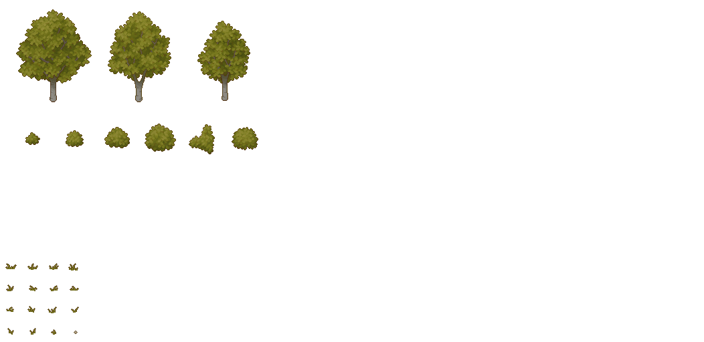
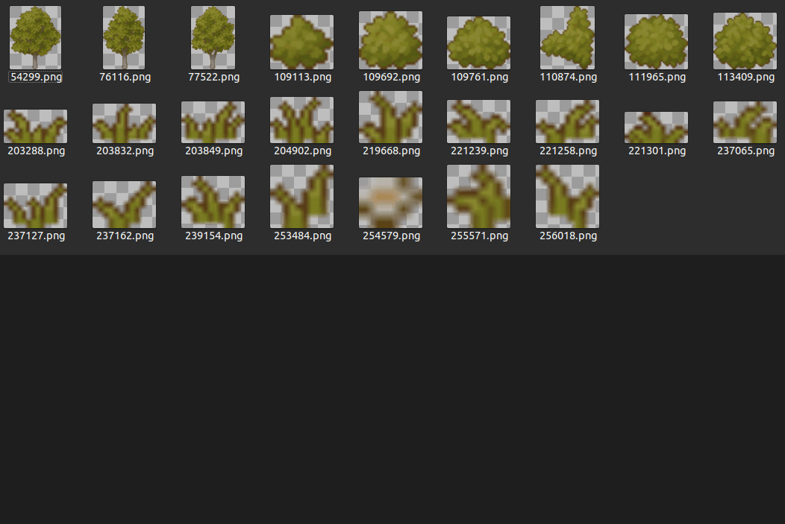

# obcutter
obcutter is a Python CLI that takes a .png image and separates the objects in the image based on the alpha channel. It can also do the inverse operation, merging split images into a single .png image.

## Prerequisites

- Python 3 or higher

To use obcutter, you will need to have the following pytho libraries installed:

- Pillow
- NumPy
- Click
- Shutil

## Installation

You can install obcutter by cloning the repository and installing the required libraries:

```
git clone https://github.com/your-username/obcutter.git
cd obcutter
pip install pillow
pip install numpy
pip install click
pip install shutil
```

## Usage

You can use obcutter by running the following command:
```
python obcutter.py [OPTIONS]
```

## Options

```
    -s, --split: Split the file into multiple files
    -w, --width INTEGER: Width of the object block to be split in pixels (default is 1)
    -h, --height INTEGER: Height of the object block to be split in pixels (default is 1)
    -b, --bounding-box: Bounds the png image to the bounding box of the pixels
    -g, --graph: Draws the graph of the objects
    -m, --merge: Merge the files into a single file
    -r, --rows INTEGER: Number of rows in the merge file (0 for auto)
    -c, --columns INTEGER: Number of columns in the merge file (0 for auto)
    -p, --spacing INTEGER: Spacing between the objects in pixels (default is 1)
    --help: Show this message and exit.
```
## Examples

Here are some examples of how you can use obcutter:

### Split an image into multiple objects

To split an image into multiple objects, you can use the split option:

```
python obcutter.py --split 
```

This will create multiple output files, each containing a single object from the input image.




*Demonstration of the initial image, graph and object detection, and then the final split images.*

### Merge multiple objects into a single image

To merge multiple objects into a single image, you can use the merge option:

```
python obcutter.py --merge 
```

This will create a single output file, containing all the objects from the input files.



*Demonstration of the initial set of images and then the final merged image.*

*The sprites used on these demonstrastions are avaliable at https://cainos.itch.io/pixel-art-top-down-basic*
